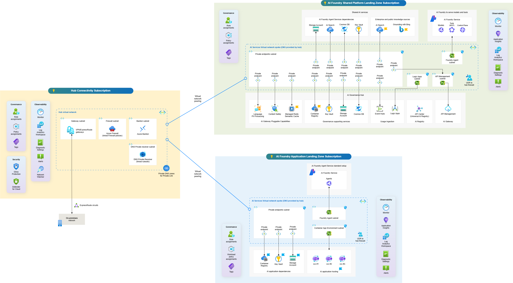

# AI Foundry Landing Zones

This repository contains Terraform code to deploy the Azure AI Foundry Landing Zone, leveraging [Azure Verified Modules](https://aka.ms/avm) (AVM).
Since the AI Foundry Landing Zone uses several Private Endpoints, this repository also provides the Azure Policy code that automates the creation of A-records in the corresponding Private DNS Zones and adds DNS forwarding rules for existing private DNS zones.

## 🧠 Overall Architecture

This architecture separates responsibilities into three layers:

- **Hub Connectivity Landing Zone (existing)** → centralized networking, security, and shared services
- **AI Foundry Shared Platform Landing Zone (new spoke)** → shared AI platform capabilities governed by platform teams
- **AI Foundry Application Landing Zone (new spoke)** → workload-specific AI applications owned by product teams

This model ensures:

- Strong **governance and reuse**
- Clear **platform vs workload separation**
- Alignment with **Azure Landing Zone** and **AI Foundry** [reference guidance](https://github.com/Azure/AI-Landing-Zones)

### 🧭 Logical View

### 🏗️ 1. Hub Connectivity Landing Zone (Existing)

#### Role

Acts as the central backbone for all landing zones.

#### Key Components

- Hub VNet with:
  - Azure Firewall / NVA
  - Private DNS Zones
  - Private DNS Resolver
  - DDoS protection
- Connectivity:
  - ExpressRoute / VPN
  - On-premises integration
- Shared services:
  - Bastion / Jump hosts
  - Central logging / SIEM
  - Identity integration (Entra ID)

#### Responsibility Model

- Owned by **central platform/network/security team**
- Provides **north-south** and **east-west** control

### ⚙️ 2. AI Foundry Shared Platform Landing Zone (Spoke)

#### 🎯 Purpose

Provides **centralized AI capabilities and reusable services** for multiple application teams.
This aligns with the concept of [**platform-managed shared resources**](https://github.com/Azure-Samples/ai-hub-gateway-solution-accelerator) that multiple workloads consume.

#### 🧩 Core Services

##### AI & Foundry Layer

- Azure AI Foundry (Account)
- Shared Foundry Projects (optional or limited)
- Azure OpenAI / model endpoints
- AI Agent services
- Prompt management / model governance

##### Data & Knowledge Layer

- Azure AI Search
- Knowledge stores (Storage / Cosmos DB)
- Shared datasets (optional depending on governance model)

##### Integration & API Layer

- API Management (internal VNet mode)
- Event Grid / Service Bus
- Shared orchestration services

##### Security & Governance

- Defender for AI / Defender for Cloud
- Azure Policy (AI-specific guardrails)
- Purview (data governance, optional)

### 🌐 Networking Model

- Deployed in a **spoke VNet**
- Peered to Hub VNet
- Uses:
  - Private Endpoints for all PaaS services
  - Hub firewall for outbound control
  - Private DNS zones inherited from hub

👉 This aligns with the statement that AI landing zones integrate with **existing hub-spoke networks and centralized services**.

### 🔐 Access Pattern

- Application landing zones consume platform services via:
  - Private endpoints (preferred)
  - Managed identities
  - RBAC delegation

### 👥 Ownership

- Managed by: 👉 Platform / AI Center of Excellence team
- Responsibilities:
  - Model lifecycle management
  - Security baselines
  - Cost control of shared AI services

## 🚀 3. AI Foundry Application Landing Zone (Spoke)

### 🎯 Purpose

Hosts **AI applications and agents**, isolated per workload or business domain.
This follows the [recommended pattern](https://github.com/Azure/terraform-azurerm-avm-ptn-aiml-landing-zone) where **workloads own their application resources**, even when using shared platform capabilities.

### 🧩 Core Components

#### Application Layer

- App Service / Container Apps / AKS
  - Web/API frontends
  - Backend microservices

#### AI Integration Layer

- Integration with:
  - Foundry platform endpoints
  - Azure OpenAI models
  - AI Search
- Foundry projects (if scoped to workload)

#### Data Layer

- Application-specific storage:
  - Azure SQL / Cosmos DB
  - Storage Accounts

#### Observability

- Application Insights
- Azure Monitor logs

### 🌐 Networking Model

- Separate spoke VNet
- Peered to:
  - Hub VNet
  - Optionally to Platform LZ (via hub routing)
- Uses:
  - Private endpoints for all dependencies
  - Forced tunneling via hub firewall

### 🔄 Traffic Flow (Typical)

1. User → Application (App Gateway / Frontend)
2. Application → AI Foundry Platform (private endpoint)
3. Platform → Models / Data services
4. Outbound traffic controlled by Hub Firewall

This matches the reference architecture where applications interact with Foundry and services via private endpoints inside the VNet. 

### 👥 Ownership

- Managed by: 👉 Application / Product teams
- Responsibilities:
  - Application lifecycle
  - Prompt engineering
  - Integration logic

## Quick Start

- To deploy the AI Foundry Shared Platform Landing Zone (Spoke), check the instructions at [AI Foundry Shared Platform Landing Zone](./ai-shared-plat-lz/README.md)
- To deploy the AI Foundry Application Landing Zone (Spoke), check the instructions at [AI Foundry Application Landing Zone](.solutions/ai-applications-lz/README.md)
