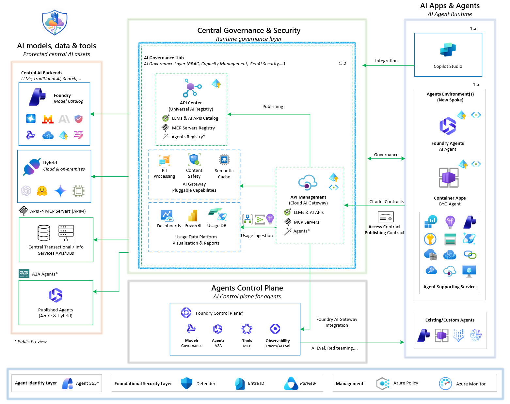

# 🏰 Citadel Governance Hub

<div align="center">
    
    <br>
    <strong>Enterprise AI Landing Zone</strong>
    <br>
    <em>A comprehensive solution accelerator for governing, observing, and accelerating AI deployments at scale with unified security, compliance, and intelligent orchestration.</em>
</div>

---

## 🚀 Overview

Citadel Governance Hub is an **enterprise-grade AI landing zone** that provides a centralized, governable, and observable control plane for AI consumption across teams and environments.

This repository is a **solution accelerator** that helps you deploy and operate the hub using:

- Infrastructure-as-code (Bicep)
- A unified AI gateway pattern (Azure API Management)
- Usage ingestion components (Logic Apps + Azure Functions)
- Validation notebooks and operational guides

## 🏛️ Part of the Foundry Citadel Platform

> [!IMPORTANT]
> This accelerator is the **reference implementation of Layer 1 – Governance Hub** in the [AI Citadel Platform](https://aka.ms/foundry-citadel) layered security architecture.

The **AI Citadel Platform** is a unified, layered approach to AI security and compliance, designed to enable enterprises to scale AI innovation while maintaining trust, security, and regulatory alignment. The platform is composed of four interlocking layers:

| Layer | Name | Responsibility | Implementation |
|-------|------|----------------|----------------|
| 🔷 **Layer 1** | **Governance Hub** | Runtime enforcement — unified AI gateway, policy-as-code, identity validation, token rate limiting, content filtering, cost attribution | **👉 This Accelerator** ([aka.ms/ai-hub-gateway](https://aka.ms/ai-hub-gateway)) |
| 🔶 **Layer 2** | **AI Control Plane** | Observability & compliance — agent traces, AI evaluations, fleet operations, automated compliance checks | [Microsoft Foundry Control Plane](https://learn.microsoft.com/en-us/azure/ai-foundry/control-plane/overview) |
| 🟢 **Layer 3** | **Agent Identity (Agent 365)** | Agent identity & lifecycle — unique agent identities, shadow agent detection, sponsorship model, access packages | [Governing Agent Identities with Entra ID](https://learn.microsoft.com/en-us/entra/id-governance/agent-id-governance-overview) |
| 🛡️ **Layer 4** | **Security Fabric** | Unified protection — Microsoft Defender threat intelligence, Purview data governance, Entra access control | Microsoft Defender, Purview & Entra |

The layers are not isolated silos — they form an integrated architecture grounded in the principle of **separation of concerns with unified oversight**. Layer 1 (this accelerator) acts as the physical gateway through a hub-and-spoke deployment where a centrally managed AI gateway (Azure API Management) enforces runtime policies, while spoke environments give each business unit autonomous development within guardrails.

> 📎 For the full Citadel Platform approach and guidance, visit: [aka.ms/foundry-citadel](https://aka.ms/foundry-citadel)

---

## 🌟 Benefits (Summary)

Citadel Governance Hub helps you standardize AI governance while maintaining developer velocity:

- **Governance & security**: consistent access control, identity patterns, policy enforcement
- **Observability & compliance**: central logging/metrics and near real-time usage analytics
- **Developer velocity**: repeatable onboarding patterns and contract-driven configuration

For a detailed stakeholder- and capability-level breakdown, see [Governance Hub Benefits](./guides/governance-hub-benefits.md).

---

## 🧩 What's in This Repo

At a high level, the accelerator includes:

- [bicep/infra](./bicep/infra): main IaC entrypoint and modules for provisioning the hub.
- [src/usage-ingestion-logicapp](./src/usage-ingestion-logicapp): Logic App workflows for processing usage/log streams and other governance workflows.
- [validation](./validation): Jupyter notebooks for post-deployment validation and onboarding.
- [guides](./guides): operational and architecture documentation.

## 🏗️ Architecture Overview

AI Citadel Governance Hub follows a **hub-spoke architecture** that integrates seamlessly with your existing enterprise Azure Landing Zone:



### Networking approach

Detailed networking approach guidance for Citadel Governance Hub can be found in the [Network Approach Guide](./guides/network-approach.md).

Below is a high-level overview of the two supported deployment approaches:

#### Part of the hub network

In this approach, the Citadel Governance Hub is deployed within the existing hub virtual network (VNet) of your Azure Landing Zone.

This allows for direct communication between the unified AI gateway and connected agentic spokes, leveraging existing security and networking configurations.

#### Part of spoke network

In this approach, the Citadel Governance Hub is deployed within a dedicated spoke VNet that connects to the hub VNet via VNet peering. 

Agentic workloads in other spokes are routed first to the hub network firewall through direct peering, then forwarded to the Citadel Governance Hub gateway network.

This provides an additional layer of isolation for AI workloads while still enabling secure communication with other enterprise resources in the hub.

### 🎯 **Citadel Governance Hub** - Central Control Plane

The central governance layer with unified AI Gateway that all AI workloads route through.

#### Core Components

| Component | Purpose | Enterprise Features |
|-----------|---------|---------------------|
| **🚪 API Management** | Unified AI gateway | LLM governance, AI resiliency, AI registry gateway |
| **📘 API Center** | Universal AI Registry | Discovery of available AI tools, agents and AI services |
| **🔍 Microsoft Foundry** | Control Plane/Models/Observability | Platform LLMs, Control Plane & AI Evaluations |
| **📊 Log Analytics** | Logs, metrics & audits | Scalable enterprise telemetry ingestion and storage |
| **📊 Application Insights** | Platform monitoring | Performance dashboards, automated alerts |
| **📨 Event Hub** | Usage data streaming | Real-time usage streaming, custom logging |
| **🗄️ Cosmos DB** | Usage analytics | Long-term storage of usage, automatic scaling |
| **⚡ Logic App** | Event processing | Workflow-based processing of usage/logs & AI Eval |
| **🔗 Virtual Network** | Private connectivity | BYO-VNET support, private endpoints |

#### Security & Compliance

AI Gateway security & compliance enforcements components:

| Component | Purpose |Enterprise Features |
|---------|---------|---------------------|
| **🔐 Managed Identity** | Zero-credential auth | Secure service-to-service communication |
| **🛡️ Content Safety** | LLM protection | Prompt Shield and Content Safety protections |
| **💳 Language Service** | PII detection | Natural language and RegEx based PII entity detection with anonymization support |
| **🔍 Microsoft Foundry** | Control Plane | Control plane, responsible AI, registration of external agents  |

Supported by subscription wide security services:

| Component | Purpose |Enterprise Features |
|---------|---------|---------------------|
|**Defender for AI**|Threat protection|AI workload security posture management|
|**Purview**|Data governance|Sensitivity labeling, data classification|
|**Entra ID**|Identity & access management|Zero Trust architecture, conditional access|

#### AI Services

Optionally you can deploy one or more generative AI services as part of the Citadel Governance Hub to provide fully functional gateway with LLMs already integrated:

| Component | Purpose | Enterprise Features |
|---------|---------|---------------------|
| **Microsoft Foundry** | Model Catalog | Access to rich foundational model catalog with variety of deployment options |

#### Optional Components

Pluggable components to enhance AI Citadel Governance capabilities:

| Component | Purpose |
|-----------|---------|
| **Azure Managed Redis** | Semantic caching layer for high-throughput AI workloads |

### 🌐 **Citadel Compliant Agents** - Existing and new agents on-boarding

To govern AI agents through AI Citadel Governance Hub, agents must communicate with AI backends (central LLMs, tools and agents) through the Citadel's unified AI gateway.

#### Existing agents

Guidance to bring existing agents is through updating endpoint and credentials to access central LLMs, tools and agents through the **unified gateway**.

Recommendation is to use Azure Key Vault to store these information due to its sensitivity when the agent is running on Azure.

Leverage **Citadel Access Contracts** to declare the required access to LLMs, tools and agents through the gateway along with precise governance policies.

#### New agents

Building new agents is accelerated through the **Citadel Agent Environment** landing zone guidance, which provides isolated, secure environments designed specifically for AI agent development and deployment. Each spoke serves a single business unit or major use case, ensuring clear boundaries, simplified management, and integration with the Citadel Governance Hub for centralized governance.

For detailed guidance, see [AI App Landing Zone Repo](https://github.com/Azure/AI-Landing-Zones).

**Deployment Approach:**
- **One spoke per business unit or use case** - Dedicated environments for insurance claims processing, customer support automation, or other agentic scenarios
- **Flexible runtime options** - Choose between Microsoft Foundry Agents (fully managed runtime) or Azure Container Apps (bring-your-own-agent)
- **Pre-configured infrastructure** - Automated deployment via Bicep or Terraform with all networking, security, and monitoring built-in
- **Hub integration** - Seamless connection to Citadel Governance Hub through **Citadel Access Contracts**

**Deployment Patterns:**
- **Greenfield (Standalone with New Resources)** - Creates all infrastructure from scratch with new VNet and Log Analytics workspace
- **Brownfield (Standalone with Existing Resources)** - Integrates with existing enterprise landing zones, reusing VNets and centralized monitoring

> **Note:** Citadel Agent Environment deployment supports the AI development velocity pillar and is designed to work in conjunction with Citadel Governance Hub. Multiple environments can connect to a single hub for unified governance and observability.

---

## 🔄 AI Citadel Contracts - Connect agents to governance hub

Citadel Governance Hub seamlessly integrates with **Citadel compliant Agents** environments through automated governance alignment:

### 📝 **AI Access Contract**
Declares the governed dependencies an agent needs—LLMs, AI services, tools, and reusable agents—along with precise access policies:
- Model selection and capacity allocation
- Regional preferences and compliance requirements
- Safety and security guardrails (content safety, PII handling, OAuth scopes,...)
- Usage quotas and cost limits

### 📤 **AI Publish Contract**
Describes the tools and agents a spoke exposes back to the hub:
- Publishing rules and governance gates
- Ownership metadata and documentation
- Security posture and compliance status
- Discovery and cataloging in the AI Registry

>NOTE: Publish contracts are upcoming and will be available in future releases.

**Benefits:**
- ✅ Audit-ready traceability through infrastructure-as-code
- ✅ Faster release cycles with automated approvals
- ✅ Reduced manual effort in governance onboarding
- ✅ Continuous policy compliance verification

> 🔗 **Learn More:** [AI Citadel Access Contracts Guide](./bicep/infra/citadel-access-contracts/README.md)

---

## 📋 Prerequisites

**Azure Requirements:**
- **Azure CLI** and **Azure Developer CLI** installed and signed in
- A **resource group** in your target subscription  
- **Owner** or **Contributor + User Access Administrator** permissions on the subscription
- All required subscription resource providers registered.

**Development Tools:**
Although it is recommended to have the below tools installed on a local machine or through DevOps agents to conduct the provisioning, you still can leverage Azure Cloud Shell (mounted to storage account) as an alternative which has all the tools pre-installed.
- [Azure Developer CLI (azd)](https://learn.microsoft.com/azure/developer/azure-developer-cli/install-azd)
- [Azure CLI](https://learn.microsoft.com/en-us/cli/azure/install-azure-cli)
- [VS Code](https://code.visualstudio.com/Download) (optional)

---

## 🚀 Quick Deploy

Deploy your Citadel Governance Hub in minutes with Azure Developer CLI:

```bash
# Authenticate and setup environment
azd auth login

# in a new folder, initialize the template (i.e. folder name: ai-hub-citadel-dev)
azd init --template Azure-Samples/ai-hub-gateway-solution-accelerator -e ai-hub-citadel-dev --branch citadel-v1

# Deploy Citadel Governance Hub
azd up
```

> 💡 **Tip**: Use Azure Cloud Shell to avoid local setup. Review [main.bicep](./bicep/infra/main.bicep) and [main.bicepparam](./bicep/infra/main.bicepparam) configuration before deployment.

### ✅ Post-Deployment Validation

After successful deployment, validate your Citadel Governance Hub setup using our interactive notebooks.

### 🧪 Validation Notebooks

Use the following interactive Jupyter notebooks to validate and configure your Citadel Governance Hub deployment:

| Notebook | Description |
|----------|-------------|
| [**LLM Backend Onboarding**](./validation/llm-backend-onboarding-runner.ipynb) | Onboard existing LLMs (Microsoft Foundry models, Azure OpenAI, and others) into the AI Gateway. Generates source-controllable parameter files for LLM backends configuration. |
| [**Citadel Access Contracts Tests**](./validation/citadel-access-contracts-tests.ipynb) | Create 3 different access contracts for 3 use cases with various integration requirements. |
| [**Citadel Agent Frameworks Tests**](./validation/citadel-agent-frameworks-tests.ipynb) | Activate 3 different access contracts using various agent frameworks (Microsoft Agent Framework, Microsoft Foundry Agent SDK, LangChain) |
| [**Citadel PII Processing Tests**](./validation/citadel-pii-processing-tests.ipynb) | Test PII detection and masking capabilities within the Citadel Governance Hub. |
| [**Citadel JWT Authentication Tests**](./validation/citadel-jwt-authentication-tests.ipynb) | Validate JWT-based authentication and app role authorization across all LLM API endpoints, including dual auth flows and negative testing. |
| [**Citadel Unified AI API Tests**](./validation/citadel-unified-ai-api-tests.ipynb) | Validate the Unified AI Wildcard API across different model providers (Azure OpenAI, Foundry, Gemini) and API patterns with load testing. |

> 💡 **Tip**: These notebooks require Python with the `openai`, `requests`, and `matplotlib` among other packages highlighted in [requirements.txt](./validation/requirements.txt). Ensure you have configured your environment variables before running.

---

## 📚 Comprehensive Documentation

Master AI Citadel Governance Hub implementation and operations with our detailed guides:

### 📖 **Concepts & Benefits**

| Guide | Description |
|-------|-------------|
| [**🆕 Governance Hub Benefits**](./guides/governance-hub-benefits.md) | Detailed benefits and stakeholder value of adopting Citadel Governance Hub |
| [**🆕 Citadel Sizing Guide**](./guides/citadel-sizing-guide.md) | Guidance on sizing the Citadel Governance Hub based on workloads and environments |
| [**🆕 PTU Estimation Guide**](./guides/put-estimation-guide.md) | Azure OpenAI / Foundry LLM sizing guide for PTU vs Pay-as-you-Go capacity planning |

### 🏗️ **Landing zone deployment**

| Guide | Description |
|-------|-------------|
| [**🆕 Quick Deployment Guide**](./guides/quick-deployment-guide.md) | Fast deployment for non-production environments |
| [**🆕 Full Deployment Guide**](./guides/full-deployment-guide.md) | Comprehensive guide for dev, staging, and production |
| [**🆕 Parameters Deployment Guide**](./guides/parameters-usage-guide.md) | Comprehensive Bicep parameter file usage |
| [**🆕 Network Approach Guide**](./guides/network-approach.md) | Detailed networking approach for Citadel Governance Hub deployment |

### 🔧 **AI Service Integration**

| Guide | Description |
|-------|-------------|
| [**🆕 LLM Backend Onboarding Guide**](./bicep/infra/llm-backend-onboarding/README.md) | Independent LLM backend routing deployment with load balancing and failover |
| [**🆕 APIM Gateway Upgrade Guide**](./bicep/infra/apim-gateway-upgrade/README.md) | Update gateway policies, APIs, backends, diagnostics, and named values on an existing APIM instance without re-provisioning infrastructure |

### 🔧 **Use-case Onboarding**

| Guide | Description |
|-------|-------------|
| [**🆕 AI Citadel Access Contracts Guide**](./bicep/infra/citadel-access-contracts/README.md) | Guide on integrating new/existing AI apps & agents with AI Citadel Governance Hub |
| [**🆕 AI Citadel Access Contracts Policies**](./bicep/infra/citadel-access-contracts/citadel-access-contracts-policy.md) | Deep dive into policy configurations for AI Citadel Access Contracts |


### 🛡️ **Security & Compliance**

| Guide | Description |
|-------|-------------|
| [**🆕 PII Detection & Masking**](./guides/pii-masking-apim.md) | Automated sensitive data protection |
| [**🆕 Entra ID Authentication**](./guides/entraid-auth-validation.md) | JWT validation and Zero Trust implementation |
| [**🆕 JWT Client Identity & Permissions**](./guides/jwt-client-identity-permissions.md) | Configure client app identities, group-based access management, and permissions for JWT-protected endpoints |

### 📊 **Observability & Analytics**

| Guide | Description |
|-------|-------------|
| [**🆕 Power BI Dashboard**](./guides/power-bi-dashboard.md) | Usage analytics and cost allocation dashboards |

### 🏗️ **Architecture & configurations**

| Guide | Description |
|-------|-------------|
| [**🆕 LLM Routing Architecture**](./guides/llm-routing-architecture.md) | Technical dive into LLM model and backend routing logic |
| [**🆕 LLM Backend Onboarding Guide**](./guides/LLM-Backend-Onboarding-Guide.md) | How to onboard LLM backends (Azure OpenAI, Foundry, external providers) with dynamic routing and load balancing |
| [**🆕 Throttling Events Handling**](./guides/throttling-events-handling.md) | Monitor and handle throttling events per use case, deployment, and other dimensions |

---

## 🤝 Contributing

We welcome contributions from the community! Whether it's:
- 🐛 Bug reports and fixes
- 📖 Documentation improvements
- 💡 Feature requests and enhancements

Please see our [Contributing Guide](./CONTRIBUTING.md) for details.

---

## 📞 Support & Community

- **🐛 Issues**: [GitHub Issues](https://github.com/Azure-Samples/ai-hub-gateway-solution-accelerator/issues)

---

## 📄 License

This project is licensed under the MIT License - see the [LICENSE](LICENSE) file for details.

---

<div align="center">

**Citadel Governance Hub** - Your organization's fortress in the new world of AI

*Providing protection, structure, and strength as you scale new heights with enterprise AI*

[🚀 Deploy Now](./guides/quick-deployment-guide.md) | [📚 Documentation](./guides/) | [🤝 Contribute](#-contributing)

</div>
