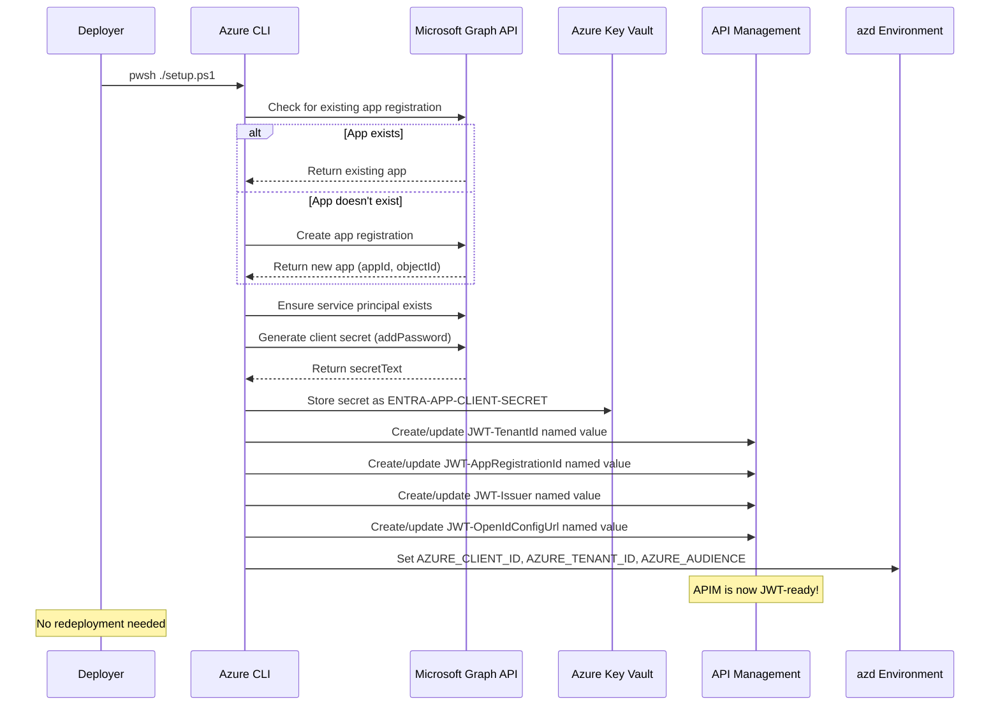

# 🔐 Entra ID Setup for AI Hub Gateway

## Overview

Independent deployment module that creates a Microsoft Entra ID App Registration and **directly configures APIM JWT named values** for JWT authentication with the Citadel's AI Governance Hub.

This is a **standalone operation** — no redeployment of the main landing zone (`azd up`) is required. After running the setup script, APIM is immediately configured for JWT authentication.

## What Gets Created / Configured

| Resource | Description |
|----------|-------------|
| **Entra ID App Registration** | App with OAuth2 scope (`access_as_user`), app role (`Task.ReadWrite`), sign-in audience `AzureADMyOrg` |
| **Application ID URI** | Set to `api://{appId}` — used as the JWT audience for token validation |
| **Service Principal** | Service principal for the app registration |
| **Client Secret** | 2-year client secret stored in Key Vault as `ENTRA-APP-CLIENT-SECRET` |
| **APIM Named Value: JWT-TenantId** | Entra ID tenant ID for JWT validation |
| **APIM Named Value: JWT-AppRegistrationId** | App registration client ID (audience) |
| **APIM Named Value: JWT-Issuer** | Token issuer URL (`https://login.microsoftonline.com/{tenantId}/v2.0`) |
| **APIM Named Value: JWT-OpenIdConfigUrl** | OpenID Connect configuration endpoint |
| **azd Environment Variables** | `AZURE_CLIENT_ID`, `AZURE_TENANT_ID`, `AZURE_AUDIENCE`, `ENTRA_CLIENT_SECRET` |

## Prerequisites

| Requirement | Description |
|-------------|-------------|
| **Azure CLI** | Authenticated (`az login`) |
| **Entra ID Permissions** | `Application.ReadWrite.All` or Application Developer role |
| **Key Vault** | Must exist (deployed by `azd up`) |
| **Key Vault Access** | Deployer needs `Key Vault Secrets Officer` role |
| **APIM Instance** | Must exist (deployed by `azd up`) |
| **APIM Access** | Deployer needs `API Management Service Contributor` role |
| **azd** | Azure Developer CLI installed (for environment variable storage) |

>NOTE: For Key Vault Access, you can assign the `Key Vault Secrets Officer` role to your user account on the Key Vault. 
>- The main deployment does not automatically assign this role. The following command show example execution ```az role assignment create --role "Key Vault Secrets Officer" --assignee "REPLACE@TENANT.onmicrosoft.com" --scope (az keyvault show --name kv-REPLACE --query id --output tsv)```
>- Azure Key Vault public network access is disabled by default. Ensure you can access Key Vault from the machine that will run the setup script. You may need to enable public network access temporarily or run the script from a VM with access to the Key Vault.

## Usage

### Recommended Flow

```bash
# 1. Deploy the gateway infrastructure first (creates Key Vault, APIM, etc.)
azd up

# 2. Run the Entra ID setup (creates app registration + configures APIM directly)
cd bicep/infra/entra-id-setup
pwsh ./setup.ps1

# Done! APIM is now JWT-ready. No redeployment needed.
# Configure access contracts with jwtAuth.enabled=true to enforce JWT per product.
```

### With Explicit Parameters

```bash
pwsh ./setup.ps1 -EnvironmentName "citadel-dev" -KeyVaultName "kv-abc123" -ApimResourceGroup "rg-citadel-dev" -ApimName "apim-abc123"
```

### Using azd Environment (Auto-Detected)

```bash
# All values auto-detected from azd environment
pwsh ./setup.ps1
```

## How It Works



## Integration with Main Deployment

The setup script configures APIM directly — **no redeployment is needed**. After running the script:

1. **APIM named values** are live and used by the unified `security-handler` policy fragment across all three API endpoints (Azure OpenAI API, Universal LLM API, Unified AI API)
2. **Access contracts** can set `jwtRequired: true` in their product policy to enforce JWT per product
3. **azd env vars** are stored for future `azd up` runs (values flow through `main.bicepparam`)

### Subsequent `azd up` Runs

Future redeployments will not overwrite the APIM named values with `'not-configured'` because the azd environment variables (`AZURE_CLIENT_ID`, `AZURE_TENANT_ID`, `AZURE_AUDIENCE`) are now populated. The Bicep deployment reads these and sets the named values to the correct values.

## Idempotency

The script is fully idempotent:
- **App Registration**: Searched by `displayName` — reuses existing if found
- **Service Principal**: Searched by `appId` — reuses existing if found  
- **Client Secret**: Always generates a fresh secret and updates Key Vault
- **azd Variables**: Always overwritten with current values

Re-running the script after a partial failure or for secret rotation is safe.

## Bring Your Own App Registration

If you already have an Entra ID App Registration, skip this script and set the values directly:

```bash
azd env set AZURE_CLIENT_ID "your-client-id"
azd env set AZURE_TENANT_ID "your-tenant-id"
azd env set AZURE_AUDIENCE "api://your-client-id"
azd env set ENTRA_CLIENT_SECRET "your-client-secret"
```

Then run `azd up` — the main deployment will use your existing app registration values.

## Files

```
entra-id-setup/
├── setup.ps1          # PowerShell script for Entra ID provisioning
├── main.bicep         # Placeholder Bicep (documentation only)
└── README.md          # This file
```

## Troubleshooting

### "Not logged in to Azure CLI"
Run `az login` and ensure you're connected to the correct tenant.

### "Application.ReadWrite.All permission required"
The deploying user needs Entra ID permissions to create app registrations. Ask your tenant admin to grant `Application.ReadWrite.All` or assign the `Application Developer` role.

### "Key Vault not found"
Run `azd up` first to create the infrastructure (Key Vault, APIM, etc.), then run this script.

### "Access denied to Key Vault"
Ensure you have `Key Vault Secrets Officer` role on the Key Vault. The main deployment grants this to the APIM managed identity, but you also need it for your user account.

## Related

- [Full Deployment Guide](../../../guides/full-deployment-guide.md) — Complete deployment instructions
- [Entra ID Authentication Guide](../../../guides/entraid-auth-validation.md) — JWT validation configuration
- [Access Contracts](../citadel-access-contracts/README.md) — Per-product JWT enforcement
- [JWT Authentication Validation Notebook](../../../validation/citadel-jwt-authentication-tests.ipynb) — End-to-end JWT testing across all 3 API endpoints
