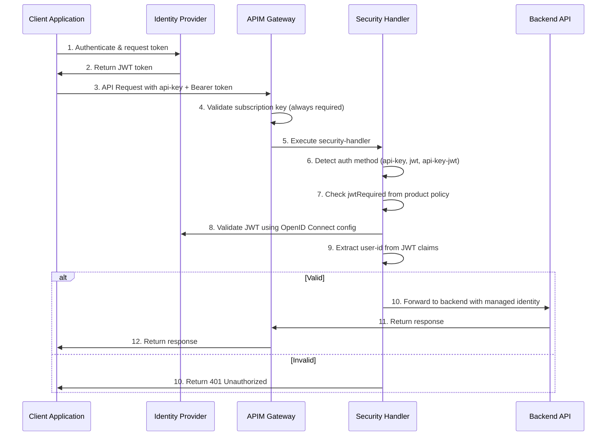

# Understanding JWT Token Authentication with AI Hub Gateway

For use cases requiring additional security beyond subscription keys, JWT token validation provides a robust second authentication layer. The AI Hub Gateway uses a **unified `security-handler` policy fragment** that enforces consistent JWT authentication across all three API endpoints: Azure OpenAI API, Universal LLM API, and Unified AI API out of the box (can be extended to additional endpoints like other APIs and MCPs as well).

The gateway supports any **OAuth 2.0 / OpenID Connect** identity provider (Microsoft Entra ID, Auth0, Okta, etc.) via configurable APIM named values.

## Unified Authentication Architecture

JWT authentication is controlled per-product via Access Contracts:
- **API Key Only (default)**: Access contracts that only require a valid APIM subscription key
- **API Key + JWT (enforced)**: Access contracts that set `jwtRequired=true` to require both API key and valid JWT Bearer token

The `security-handler` fragment is included in **all three API-level policies**, providing uniform authentication behavior regardless of which endpoint a client uses.



## Approach 1: Access Contract JWT Integration (Recommended)

This is the recommended approach for the AI Hub Gateway. It uses Access Contracts to enforce JWT authentication per-product and works uniformly across all three API endpoints.

### Setup

**Step 1: Configure JWT Named Values**

For Microsoft Entra ID, run the setup script (detailed guide is here[entra-id-setup/README.md](../bicep/infra/entra-id-setup/)) to create an app registration and populate the following APIM named values:

```bash
cd bicep/infra/entra-id-setup
pwsh ./setup.ps1
```

For other identity providers, or for manually configured Entra ID tenants, these APIM named values must be set in the Azure portal or via CLI:

| Named Value | Description | Example (Entra ID) | Example (Auth0) |
|-------------|-------------|---------------------|-----------------|
| `JWT-OpenIdConfigUrl` | OpenID Connect discovery endpoint | `https://login.microsoftonline.com/{tenant}/v2.0/.well-known/openid-configuration` | `https://{domain}/.well-known/openid-configuration` |
| `JWT-Issuer` | Expected token issuer | `https://login.microsoftonline.com/{tenant}/v2.0` | `https://{domain}/` |
| `JWT-AppRegistrationId` | Expected audience claim | `api://{client-id}` | `https://your-api-identifier` |

**Step 2: Create an Access Contract with JWT enabled**

Set `jwtRequired=true` in the product policy:

```xml
<policies>
    <inbound>
        <base />
        <!-- Enable JWT requirement for this product -->
        <set-variable name="jwtRequired" value="true" />
        
        <!-- Other policies (model access, capacity, etc.) -->
    </inbound>
    <backend><base /></backend>
    <outbound><base /></outbound>
    <on-error><base /></on-error>
</policies>
```

**Step 3: Test with JWT token**

```http
POST https://{apim-gateway}/openai/deployments/gpt-4o/chat/completions?api-version=2024-02-15-preview
api-key: {subscription-key}
Authorization: Bearer {jwt-token}
Content-Type: application/json

{
  "messages": [{"role": "user", "content": "Hello"}],
  "max_tokens": 50
}
```

### Validation

Use the [JWT Authentication Validation Notebook](../validation/citadel-jwt-authentication-tests.ipynb) to test end-to-end JWT authentication across all three API endpoints.

## Configuring Client Application Identities

Client applications (AI agents, backend services, automation pipelines) need their own identity to acquire JWT tokens. The gateway validates the token's audience, issuer, signature, and expiry — but does **not** restrict which specific client applications can connect. Access control is enforced via the APIM subscription key (API key), which ties each request to a specific Access Contract.

For organizations that want to **further restrict** which identities can request tokens scoped to the gateway, Entra ID groups and app role assignments provide fine-grained permission management.

See the dedicated **[JWT Client Identity and Permissions Guide](./jwt-client-identity-permissions.md)** for:
- Granting gateway access via Entra ID security groups (recommended for scale)
- Configuring service principal identities (client ID + secret)
- Configuring Azure Managed Identity (zero-credential for Azure-hosted agents)
- Using external identity providers (Auth0, Okta)
- Client onboarding/offboarding checklist
- Troubleshooting identity-specific errors (`AADSTS65001`, `AADSTS700016`, etc.)

## Custom JWT Configuration per Access Contract

For scenarios where different products (access contracts) need to validate tokens from **different identity providers** or with **different audiences**, the `security-handler` fragment supports per-product overrides. Set custom variables in the product policy — unset variables fall back to the gateway's APIM named values.

### Override Variables

| Variable | Description | Falls back to Named Value |
|----------|-------------|---------------------------|
| `jwtAudience` | Custom audience claim to validate | `JWT-AppRegistrationId` |
| `jwtIssuer` | Custom token issuer to validate | `JWT-Issuer` |
| `jwtOpenIdConfigUrl` | Custom OpenID Connect discovery URL | `JWT-OpenIdConfigUrl` |

### Example: Product Using a Different Entra ID Tenant

A partner team uses a separate Entra ID tenant. Their access contract overrides the JWT settings:

```xml
<policies>
    <inbound>
        <base />
        <!-- Enable JWT requirement -->
        <set-variable name="jwtRequired" value="true" />
        
        <!-- Override JWT settings for the partner tenant -->
        <set-variable name="jwtAudience" value="api://partner-gateway-app-id" />
        <set-variable name="jwtIssuer" value="https://login.microsoftonline.com/{partner-tenant-id}/v2.0" />
        <set-variable name="jwtOpenIdConfigUrl" value="https://login.microsoftonline.com/{partner-tenant-id}/v2.0/.well-known/openid-configuration" />
        
        <!-- Model access, capacity, etc. -->
        <include-fragment fragment-id="set-llm-requested-model" />
        <set-variable name="allowedModels" value="gpt-4o" />
        <include-fragment fragment-id="validate-model-access" />
    </inbound>
    <backend><base /></backend>
    <outbound><base /></outbound>
    <on-error><base /></on-error>
</policies>
```

### Example: Product Using Auth0

```xml
<policies>
    <inbound>
        <base />
        <set-variable name="jwtRequired" value="true" />
        
        <!-- Override JWT settings for Auth0 -->
        <set-variable name="jwtAudience" value="https://my-api.example.com" />
        <set-variable name="jwtIssuer" value="https://my-company.auth0.com/" />
        <set-variable name="jwtOpenIdConfigUrl" value="https://my-company.auth0.com/.well-known/openid-configuration" />
    </inbound>
    <backend><base /></backend>
    <outbound><base /></outbound>
    <on-error><base /></on-error>
</policies>
```

### Example: Partial Override (Custom Audience Only)

Only the audience differs — issuer and OpenID config use the gateway's defaults:

```xml
<policies>
    <inbound>
        <base />
        <set-variable name="jwtRequired" value="true" />
        
        <!-- Only override audience; issuer and OpenID config fall back to APIM named values -->
        <set-variable name="jwtAudience" value="api://custom-audience-for-this-team" />
    </inbound>
    <backend><base /></backend>
    <outbound><base /></outbound>
    <on-error><base /></on-error>
</policies>
```

### How It Works

```
Product Policy                          Security Handler Fragment
─────────────                          ──────────────────────────
jwtRequired = "true"           ──►     Enforce JWT validation
jwtAudience = "custom-value"   ──►     Use "custom-value" for audience
(jwtIssuer not set)            ──►     Fall back to {{JWT-Issuer}} named value
(jwtOpenIdConfigUrl not set)   ──►     Fall back to {{JWT-OpenIdConfigUrl}} named value
```

This eliminates the need for separate authentication fragments (`aad-auth`, `aad-auth-custom`) — the unified `security-handler` handles all scenarios through a single, composable interface.

## App Role-Based Authorization

Beyond JWT authentication (validating who the caller is), the `security-handler` supports **app role authorization** (validating what the caller is allowed to do). This uses Entra ID app roles defined on the gateway's app registration and the `roles` claim in the JWT token.

### Available App Roles

The gateway's Entra ID app registration (provisioned by `entra-id-setup/setup.ps1`) defines:

| App Role | Value | Description |
|----------|-------|-------------|
| ReadWrite | `Task.ReadWrite` | Full read and write access to all gateway capabilities |
| Models.Read | `Models.Read` | Access to LLM model endpoints (chat completions, embeddings) |
| MCP.Read | `MCP.Read` | Access to MCP tool endpoints |
| Agent.Read | `Agent.Read` | Access to agent endpoints |

### Enabling Role Authorization

Set `requiredRoles` in the product policy alongside `jwtRequired`:

```xml
<policies>
    <inbound>
        <base />
        <set-variable name="jwtRequired" value="true" />
        <set-variable name="requiredRoles" value="Models.Read" />
    </inbound>
    <backend><base /></backend>
    <outbound><base /></outbound>
    <on-error><base /></on-error>
</policies>
```

Multiple roles (OR logic — any match grants access):

```xml
<set-variable name="requiredRoles" value="Models.Read,Agent.Read" />
```

### How It Works

```
Product Policy                          Security Handler Fragment
─────────────                          ──────────────────────────
jwtRequired = "true"           ──►     Enforce JWT validation
requiredRoles = "Models.Read"  ──►     Check 'roles' claim in validated JWT
                                       If Models.Read in token → allow
                                       If not → 403 Forbidden
(requiredRoles not set)        ──►     Skip role check (backward compatible)
```

### Error Responses

| Scenario | HTTP Status | Error Code | Message |
|----------|-------------|------------|----------|
| Required role missing | 403 | `insufficient_role` | Access denied. Required app role not found in token. |
| No JWT (but required) | 401 | `jwt_required` | JWT Bearer token is required for this product. |
| Invalid JWT | 401 | — | Access denied due to invalid or expired JWT bearer token. |

### Assigning Roles to Clients

Client service principals and managed identities must have the required app role assigned. See the [JWT Client Identity and Permissions Guide](./jwt-client-identity-permissions.md) for:
- Assigning roles via Entra ID groups (recommended)
- Direct role assignment via CLI
- Verifying roles appear in the `roles` claim

## Security Considerations

- **Token Lifetime**: JWT tokens should be short-lived (1 hour or less)
- **Claim Validation**: Consider requiring additional claims for more granular control
- **Secret Management**: Keep client secrets properly secured using Azure Key Vault
- **CORS Policies**: Implement appropriate CORS policies if browser clients will access the API
- **Rate Limiting**: Apply rate limiting policies to prevent abuse
- **Logging**: Enable comprehensive logging for security monitoring
- **Token Refresh**: Implement proper token refresh mechanisms in client applications

## Troubleshooting Common Issues

1. **401 Unauthorized Errors**:
   - Verify audience, issuer, and OpenID config URL values (check both custom overrides and APIM named values)
   - Check token expiration
   - Ensure proper Bearer token format

2. **Token Validation Failures**:
   - Verify OpenID configuration endpoint accessibility
   - Check issuer claim matches expected format
   - Validate audience claim in token matches `jwtAudience` or `JWT-AppRegistrationId`

3. **503 JWT Not Configured**:
   - Neither custom overrides nor APIM named values are set
   - APIM named values contain `"not-configured"` placeholder (run `entra-id-setup/setup.ps1`)

4. **403 Insufficient Role**:
   - The JWT token is valid but the `roles` claim doesn't contain any of the roles in `requiredRoles`
   - Assign the required app role to the client's service principal or managed identity
   - Verify role assignment: decode the token and check the `roles` claim

## Best Practices

1. **Use gateway-level named values** for the primary identity provider (configured once via `entra-id-setup/setup.ps1`)
2. **Use per-product overrides** (`jwtAudience`, `jwtIssuer`, `jwtOpenIdConfigUrl`) only when a product requires a different identity provider or audience
3. **Manage client identity permissions at scale** using Entra ID groups (see [JWT Client Identity and Permissions Guide](./jwt-client-identity-permissions.md))
4. **Monitor authentication metrics** to identify potential security issues
5. **Regularly rotate client secrets** and update configurations accordingly
6. **Use app role authorization** (`requiredRoles`) for fine-grained access control beyond JWT authentication
7. **Test across all three endpoints** using the [JWT Authentication Validation Notebook](../validation/citadel-jwt-authentication-tests.ipynb)

## Related Resources

- [JWT Client Identity and Permissions Guide](./jwt-client-identity-permissions.md) — Configuring client identities, group-based access, and onboarding
- [Access Contracts Policy Guide](../bicep/infra/citadel-access-contracts/citadel-access-contracts-policy.md#jwt-authentication-policy) — Configuring JWT per-product
- [JWT Authentication Validation Notebook](../validation/citadel-jwt-authentication-tests.ipynb) — End-to-end testing across all endpoints
- [Entra ID Setup README](../bicep/infra/entra-id-setup/README.md) — Provisioning Entra ID for JWT