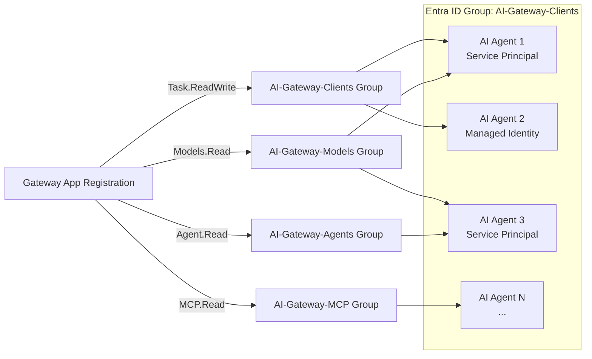

# JWT Client Identity and Permissions Management

This guide covers how to configure **client application identities** to authenticate with JWT-protected AI Hub Gateway endpoints, and how to manage permissions at scale using Entra ID groups.

> **Prerequisites:** The gateway must already be configured for JWT authentication. See the [JWT Authentication Guide](./entraid-auth-validation.md) for setup instructions on configuring the gateway's `security-handler` and APIM named values.

## When Do You Need This Guide?

By default, the gateway's `security-handler` validates JWT tokens by checking the **audience**, **issuer**, **signature**, and **expiry** claims. It does **not** restrict which specific client applications can connect — any identity in your tenant that can obtain a token with the correct audience is accepted.

If you need to:
- **Control which applications can request tokens** scoped to the gateway's audience
- **Manage access at scale** across many AI agents and services
- **Onboard/offboard clients** without modifying gateway configuration

Then this guide provides the patterns for granting and managing those permissions.

## What the Gateway Validates (Recap)

| Claim | Validated Against | Description |
|-------|-------------------|-------------|
| **Audience (`aud`)** | `JWT-AppRegistrationId` or `jwtAudience` override | Token must target the gateway's audience |
| **Issuer (`iss`)** | `JWT-Issuer` or `jwtIssuer` override | Token must come from expected identity provider |
| **Signature** | Keys from `JWT-OpenIdConfigUrl` or `jwtOpenIdConfigUrl` override | Token signature verified using provider's public keys |
| **Expiry (`exp`)** | Current time | Token must not be expired |
| **Roles (`roles`)** | `requiredRoles` variable (per-product, optional) | If set, token must contain at least one of the required app roles |

Access control beyond token validation is enforced via the **APIM subscription key** (API key), which ties each request to a specific Access Contract (product).

## Granting Gateway Access via Entra ID Groups (Recommended)

Instead of granting the gateway's app role to each client identity individually, use an **Entra ID security group** to manage access at scale. Assign the gateway's app role to the group once, then add or remove client identities (service principals, managed identities) as group members.



> **Available App Roles:** The gateway defines `Task.ReadWrite`, `Models.Read`, `MCP.Read`, and `Agent.Read`. Assign different roles to different groups for fine-grained access control. Products can require specific roles via `requiredRoles` in the product policy.

### Step 1: Create a Security Group

Create an Entra ID security group that will hold all client identities authorized to access the gateway:

```bash
# Create a security group for gateway clients
az ad group create --display-name "Citadel-AI-Gateway-Model-Readers" --mail-nickname "citadel-ai-gateway-model-readers" --description "Service principals and managed identities authorized to access the Citadel's Governance Hub JWT-protected APIs"
```

Note the group's `id` (object ID) from the output.

```bash
az ad group list --filter "displayName eq 'Citadel-AI-Gateway-Model-Readers'" --query "[0].id" --output tsv
```

### Step 2: Assign the Gateway's App Role to the Group

For fine-grained access, we will create a app-role assignment for model access (e.g., `Citadel-AI-Gateway-Model-Readers` for `Models.Read`):

```powershell
# Get the gateway app's service principal ID (created manually or via the provided script in bicep\infra\entra-id-setup\setup.ps1)
$gatewaySpId = az ad sp list --filter "appId eq '{gateway-app-id}'" --query "[0].id" --output tsv
echo "Gateway Service Principal ID: $gatewaySpId"

# Get the desired app role ID (e.g., Task.ReadWrite, Models.Read, MCP.Read, Agent.Read)
$roleId = az ad app show --id '{gateway-app-id}' --query "appRoles[?value=='Models.Read'].id" --output tsv
echo "Role ID: $roleId"

# Get the group's object ID
$groupId = az ad group show --group "Citadel-AI-Gateway-Model-Readers" --query "id" --output tsv
echo "Group ID: $groupId"

# Assign the app role to the group
@{ principalId = $groupId; resourceId = $gatewaySpId; appRoleId = $roleId } | ConvertTo-Json | Set-Content -Path body.json
az rest --method POST `
  --uri "https://graph.microsoft.com/v1.0/groups/$groupId/appRoleAssignments" `
  --body '@body.json'
Remove-Item body.json
```

> **Prerequisite:** The group must be a **security group** (not Microsoft 365 group). The assigning user needs at least the **Cloud Application Administrator** or **Privileged Role Administrator** Entra ID role.

### Step 3: Add Client Identities to the Group

Onboarding a new client is now a single group membership operation:

**Add a service principal:**
```bash
# Get the client app's service principal object ID
$clientSpId = az ad sp list --filter "appId eq '{client-app-id}'" --query "[0].id" --output tsv

# Add to the group
az ad group member add --group "Citadel-AI-Gateway-Model-Readers" --member-id $clientSpId
```

**Add a managed identity:**
```bash
# Get the managed identity's principal ID
$miPrincipalId = az identity show --name my-ai-agent-identity --resource-group my-rg --query "principalId" --output tsv

# Add to the group
az ad group member add --group "Citadel-AI-Gateway-Model-Readers" --member-id $miPrincipalId
```

**Verify membership:**
```bash
az ad group member list --group "Citadel-AI-Gateway-Model-Readers" --query "[].{name:displayName, userId:id, user:userPrincipalName}" --output table 
```

**Remove a client (offboarding):**
```bash
az ad group member remove --group "Citadel-AI-Gateway-Model-Readers" --member-id {principal-id}
```

### Why Groups Are Preferred

| Aspect | Per-Identity Role Assignment | Group-Based Assignment |
|--------|------------------------------|------------------------|
| **Onboarding** | Graph API call per identity | `az ad group member add` |
| **Offboarding** | Find and remove role assignment | `az ad group member remove` |
| **Audit** | Query each identity's role assignments | `az ad group member list` |
| **Scale** | O(n) API calls for n agents | O(1) role assignment + O(n) group adds |
| **Governance** | Scattered across identity objects | Single group with clear membership |

> **Note:** Group membership changes propagate within minutes. New members can acquire tokens with the correct audience immediately after being added.

## Client Identity Types

### Identity Type 1: Entra ID App Registration (Service Principal)

Use this when the client application runs outside Azure (on-premises, other clouds, developer workstations) or when you need explicit credentials (client ID + secret/certificate).

#### Step 1: Create or Use an Existing App Registration

The client application needs its own app registration in the **same Entra ID tenant** as the gateway:

```bash
# Create a new app registration for the client
az ad app create --display-name "my-ai-agent"
```

Note the `appId` from the output — this is the client's identity.

#### Step 2: Create a Client Secret

> **Note:** For production scenarios, consider using a certificate credential instead of a client secret for improved security.

```bash
# Get the app's object ID
az ad app list --display-name "my-ai-agent" --query "[0].id" --output tsv

# Generate a credential
az ad app credential reset --id {app-object-id} --display-name "gateway-access" --years 1
```

Store the generated `password` securely (e.g., Azure Key Vault, environment variable).

#### Step 3: Grant Permission to the Gateway

**Recommended: Add to the `Citadel-AI-Gateway-Model-Readers` group:**

```bash
# Ensure the client app has a service principal
az ad sp create --id {client-app-id} 2>$null

# Get the service principal's object ID
$clientSpId = az ad sp list --filter "appId eq '{client-app-id}'" --query "[0].id" --output tsv

# Add to the gateway clients group
az ad group member add --group "Citadel-AI-Gateway-Model-Readers" --member-id $clientSpId
```

**Alternative: Direct app role assignment** (for single-identity scenarios):

<details>
<summary>Click to expand direct assignment instructions</summary>

**Option A: Admin consent via Azure Portal**

1. Navigate to **Entra ID** > **App registrations** > Select the **client** app (e.g., "my-ai-agent")
2. Go to **API permissions** > **Add a permission**
3. Select **APIs my organization uses** > Search for the gateway app name (e.g., `ai-hub-gateway-{env}-unified-ai`)
4. Select the **`access_as_user`** delegated permission (or the `Task.ReadWrite` application role)
5. Click **Grant admin consent** for the tenant

**Option B: CLI**

```bash
# Get the gateway app's service principal ID
$gatewaySpId = az ad sp list --filter "appId eq '{gateway-client-id}'" --query "[0].id" --output tsv

# Get the gateway app's appRole ID (Task.ReadWrite)
$roleId = az ad app show --id {gateway-app-object-id} --query "appRoles[?value=='Task.ReadWrite'].id" --output tsv

# Assign the app role to the client's service principal
@{ principalId = "{client-sp-id}"; resourceId = $gatewaySpId; appRoleId = $roleId } | ConvertTo-Json | Set-Content -Path body.json
az rest --method POST --uri "https://graph.microsoft.com/v1.0/servicePrincipals/{client-sp-id}/appRoleAssignments" --body '@body.json'
Remove-Item body.json
```

</details>

> **Note:** Admin consent or app role assignment is required for the client credentials flow. Without it, the token request will fail with `AADSTS65001: The user or administrator has not consented to use the application`.

#### Step 4: Acquire a Token

```python
import requests

token_response = requests.post(
    f"https://login.microsoftonline.com/{tenant_id}/oauth2/v2.0/token",
    data={
        "grant_type": "client_credentials",
        "client_id": "{client-app-id}",
        "client_secret": "{client-secret}",
        "scope": "api://{gateway-app-id}/.default"
    }
)

jwt_token = token_response.json()["access_token"]
```

#### Step 5: Call the Gateway

```python
response = requests.post(
    f"https://{apim-gateway}/openai/deployments/gpt-4o/chat/completions?api-version=2024-12-01-preview",
    headers={
        "api-key": "{subscription-key}",
        "Authorization": f"Bearer {jwt_token}",
        "Content-Type": "application/json"
    },
    json={
        "messages": [{"role": "user", "content": "Hello"}],
        "max_tokens": 50
    }
)
```

### Identity Type 2: Azure Managed Identity

Use this when the client application runs on an Azure compute service (Azure Functions, Container Apps, App Service, Azure VM, AKS). Managed identities eliminate the need to manage credentials — Azure handles certificate rotation automatically.

#### Step 1: Enable Managed Identity on the Compute Resource

**System-assigned identity** (recommended for single-purpose services):
```bash
# Example: Azure Function App
az functionapp identity assign --name my-ai-agent-func --resource-group my-rg
```

**User-assigned identity** (recommended for shared identity across services):
```bash
# Create the identity
az identity create --name my-ai-agent-identity --resource-group my-rg

# Assign to compute
az functionapp identity assign --name my-ai-agent-func --resource-group my-rg --identities /subscriptions/{sub}/resourceGroups/my-rg/providers/Microsoft.ManagedIdentity/userAssignedIdentities/my-ai-agent-identity
```

Note the `principalId` (object ID) and `clientId` from the output.

#### Step 2: Grant Permission to the Gateway

**Recommended: Add to the `Citadel-AI-Gateway-Model-Readers` group:**

```bash
# Get the managed identity's principal ID
$miPrincipalId = az identity show --name my-ai-agent-identity --resource-group my-rg --query "principalId" --output tsv

# Add to the gateway clients group
az ad group member add --group "Citadel-AI-Gateway-Model-Readers" --member-id $miPrincipalId
```

**Alternative: Direct app role assignment:**

<details>
<summary>Click to expand direct assignment instructions</summary>

```bash
# Get the gateway app's service principal
$gatewaySpId = az ad sp list --filter "appId eq '{gateway-client-id}'" --query "[0].id" --output tsv

# Get the Task.ReadWrite role ID
$roleId = az ad app show --id {gateway-app-object-id} --query "appRoles[?value=='Task.ReadWrite'].id" --output tsv

# Assign the app role to the managed identity
@{ principalId = "{managed-identity-principal-id}"; resourceId = $gatewaySpId; appRoleId = $roleId } | ConvertTo-Json | Set-Content -Path body.json
az rest --method POST --uri "https://graph.microsoft.com/v1.0/servicePrincipals/{managed-identity-principal-id}/appRoleAssignments" --body '@body.json'
Remove-Item body.json
```

</details>

> **Important:** Without either group membership or direct role assignment, the managed identity can obtain a token from Entra ID, but the `aud` claim won't match the gateway's expected audience, causing a 401.

#### Step 3: Acquire a Token Using Azure Identity SDK

```python
from azure.identity import DefaultAzureCredential

credential = DefaultAzureCredential()

# The scope must be the gateway's Application ID URI with /.default
token = credential.get_token("api://{gateway-app-id}/.default")
jwt_token = token.token
```

For user-assigned managed identity, specify the client ID:

```python
from azure.identity import ManagedIdentityCredential

credential = ManagedIdentityCredential(client_id="{managed-identity-client-id}")
token = credential.get_token("api://{gateway-app-id}/.default")
jwt_token = token.token
```

#### Step 4: Call the Gateway

```python
response = requests.post(
    f"https://{apim-gateway}/models/chat/completions?api-version=2024-05-01-preview",
    headers={
        "api-key": "{subscription-key}",
        "Authorization": f"Bearer {jwt_token}",
        "Content-Type": "application/json"
    },
    json={
        "model": "gpt-4o",
        "messages": [{"role": "user", "content": "Hello"}],
        "max_tokens": 50
    }
)
```

### Identity Type 3: External Identity Provider (Non-Entra)

For client applications authenticating via a non-Entra identity provider (Auth0, Okta, AWS Cognito), configure the gateway's APIM named values — or use per-product overrides (`jwtAudience`, `jwtIssuer`, `jwtOpenIdConfigUrl`) — to point to the external provider's OpenID Connect endpoints. The client then acquires a token from that provider using its native SDK.

The key requirement is that the token's `aud` (audience) and `iss` (issuer) claims match the values configured in the gateway.

## Quick Reference: Client Onboarding Checklist

| Step | Service Principal | Managed Identity |
|------|-------------------|------------------|
| 1. Create identity | `az ad app create` + `az ad sp create` | `az identity create` or enable on compute |
| 2. Create credential | `az ad app credential reset` | Not needed (Azure-managed) |
| 3. Grant gateway access | `az ad group member add` (recommended) | `az ad group member add` (recommended) |
| 4. Assign app role | Add to role-specific group (e.g., `AI-Gateway-Models` for `Models.Read`) | Same — group membership grants the role |
| 5. Acquire token | `POST /oauth2/v2.0/token` with client credentials | `DefaultAzureCredential().get_token()` |
| 6. Call gateway | `api-key` + `Authorization: Bearer {token}` | `api-key` + `Authorization: Bearer {token}` |

## Troubleshooting

| Error | Cause | Fix |
|-------|-------|-----|
| `AADSTS65001: not consented` | Client app lacks permission to the gateway API | Add to `AI-Gateway-Clients` group or grant admin consent |
| `AADSTS700016: application not found` | Wrong client ID or wrong tenant | Verify client app exists in the same tenant |
| `AADSTS7000215: invalid client secret` | Secret expired or incorrect | Rotate the secret with `az ad app credential reset` |
| `401: invalid or expired JWT` | Token audience doesn't match gateway config | Verify token `aud` matches `JWT-AppRegistrationId` or `jwtAudience` |
| `401: jwt_required` | No Bearer token in request | Add `Authorization: Bearer {token}` header |
| `403: insufficient_role` | Token valid but missing required app role | Assign the required role to the client identity (via group or direct assignment) |
| Token works in Postman but not in code | Scope format incorrect | Use `api://{gateway-app-id}/.default` (not just the client ID) |

## Related Resources

- [JWT Authentication Guide](./entraid-auth-validation.md) — Gateway-side JWT setup and configuration
- [Access Contracts Policy Guide](../bicep/infra/citadel-access-contracts/citadel-access-contracts-policy.md#jwt-authentication-policy) — Configuring JWT per-product
- [JWT Authentication Validation Notebook](../validation/citadel-jwt-authentication-tests.ipynb) — End-to-end testing
- [Entra ID Setup README](../bicep/infra/entra-id-setup/README.md) — Provisioning the gateway's app registration
