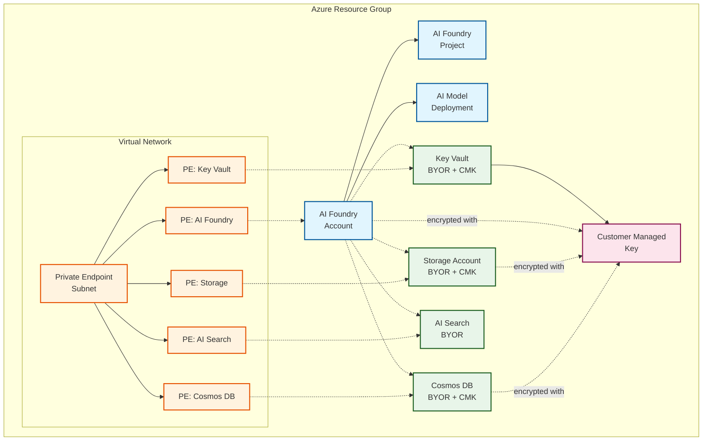

# Private with BYOR and CMK example

This deploys the module with private networking, BYOR services, and Customer Managed Keys (CMK).

## Architecture

This example demonstrates a fully secured private deployment with encryption using customer-managed keys:

**Components:**
- AI Foundry Account with GPT-4 model deployment
- AI Foundry Project for development workspace
- Private endpoints for all services
- BYOR: Key Vault, Storage Account, Cosmos DB, AI Search
- Customer Managed Keys (CMK) for encryption at rest
