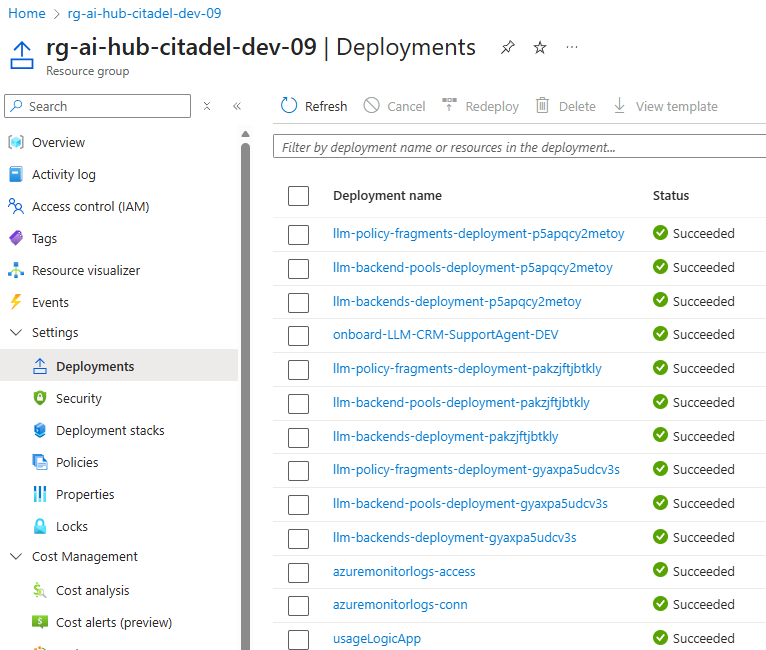

# 🚀 Quick Deployment Guide - Non-Production

This guide provides the fastest path to deploying AI Citadel Governance Hub for **development and testing environments**. For production deployments, see the [Full Deployment Guide](./full-deployment-guide.md).

---

## ⚡ Prerequisites

**Required:**
- Azure subscription with **Contributor** or **Owner** permissions
- [Azure Developer CLI (azd)](https://learn.microsoft.com/azure/developer/azure-developer-cli/install-azd) installed
- [Azure CLI](https://learn.microsoft.com/cli/azure/install-azure-cli) installed

**Optional:**
- [VS Code](https://code.visualstudio.com/) with Bicep extension
- Git for version control

> 💡 **Tip:** You can use [Azure Cloud Shell](https://shell.azure.com) which has all tools pre-installed.

---

## 🎯 Deployment Options

### Getting the template

First, initialize your local project in an empty folder (e.g. `ai-hub-citadel-deployment`):

```bash

azd init --template Azure-Samples/ai-hub-gateway-solution-accelerator -e ai-hub-citadel-dev --branch citadel-v1

# or use git clone:
# git clone https://github.com/Azure-Samples/ai-hub-gateway-solution-accelerator.git
# git checkout citadel-v1

# Make the repository your current directory:
cd ai-hub-citadel-deployment # it may differ if you used git clone

```

Then proceed to choose your deployment method:

### Option 1: Default Quick Deploy (Recommended)

Deploy with minimal configuration using intelligent defaults:

```bash

# Authenticate to Azure
# append --tenant-id <your-tenant-id> if needed
azd auth login

# Initialize environment
azd env new ai-hub-citadel-dev-01

# Provision and deploy everything based on defaults
azd up
```

This will:
- ✅ Create a new resource group
- ✅ Deploy all infrastructure with default settings
- ✅ Create new Virtual Network with private endpoints
- ✅ Create new Log Analytics workspace
- ✅ Deploy 2 AI Foundry instances with sample models
- ✅ Enable all core features (PII detection, content safety, API Center)

**Expected deployment time:** 30-45 minutes

---

### Option 2: Customized Quick Deploy

Customize key settings using environment variables:

```bash
# Authenticate and initialize
azd auth login
azd env new ai-hub-citadel-dev

# Set custom environment variables
azd env set AZURE_LOCATION eastus2
azd env set APIM_SKU Developer
azd env set ENABLE_AI_FOUNDRY true

# Deploy
azd up
```

#### Common Environment Variables

| Variable | Default | Description |
|----------|---------|-------------|
| `AZURE_LOCATION` | `eastus` | Primary Azure region |
| `APIM_SKU` | `StandardV2` | API Management SKU |
| `COSMOS_DB_RUS` | `400` | Cosmos DB throughput |
| `EVENTHUB_CAPACITY` | `1` | Event Hub capacity units |
| `ENABLE_AI_FOUNDRY` | `true` | Deploy AI Foundry instances |
| `ENABLE_API_CENTER` | `true` | Enable API Center registry |

For full list of variables, see [/bicep/infra/main.bicepparam](../bicep/infra/main.bicepparam).

---

### Option 3: Parameter File Deploy

Use the pre-configured dev parameter file:

```bash
# Authenticate
azd auth login

# Deploy using parameter file
az deployment sub create \
  --name citadel-dev-deployment \
  --location eastus \
  --template-file ./bicep/infra/main.bicep \
  --parameters ./bicep/infra/main.parameters.dev.bicepparam
```

The `main.parameters.dev.bicepparam` file includes:
- Developer SKU for cost savings
- Minimal capacity settings
- Public network access enabled (easier development)
- Application Insights dashboards enabled
- API Center disabled (reduce costs)

---

## 🔧 Post-Deployment Configuration

### 1. Verify Deployment

Deployment state are visible under `Deployments` in used resource group in the Azure Portal.



Also you can retrieve key information via AZD CLI:

```bash
# Get deployment outputs
azd env get-values
```

### 2. 🧪 Access AI Citadel Governance Hub

Head to [validation](../validation/) part of this template to run through various validation and activities related to using Citadel Governance Hub.

---

## 📊 Monitor Your Deployment

### Application Insights

1. Navigate to Azure Portal
2. Find Application Insights associated with APIM resource (name: `appi-apim-*`)
3. View:
   - Live Metrics
   - Application Map
   - Failures
   - Performance

### Usage Analytics

1. Navigate to Cosmos DB resource
2. Open Data Explorer
3. Query `usage-db` database, `usage` container

```sql
SELECT * FROM c 
WHERE c._ts > (GetCurrentTimestamp()/1000 - 3600) 
ORDER BY c._ts DESC
```
---

## 🧹 Clean Up

### Remove All Resources

```bash
# Delete all deployed resources
azd down --purge
```

---

## 🚨 Troubleshooting

### Deployment Fails

**Check provider registration:**
```bash
az provider register --namespace Microsoft.ApiManagement
az provider register --namespace Microsoft.CognitiveServices
az provider register --namespace Microsoft.DocumentDB
az provider register --namespace Microsoft.EventHub
az provider register --namespace Microsoft.Insights
az provider register --namespace Microsoft.Logic
```

**Check quota limits:**

If you got quota errors, check your subscription limits.

### APIM Takes Too Long

API Management deployment can take 30-45 minutes in classic tiers (Developer and Premium). This is normal.

---

## ⚙️ Default Configuration

The quick deployment uses these defaults (from `main.bicepparam`):

| Component | Setting | Value |
|-----------|---------|-------|
| **APIM SKU** | `apimSku` | `StandardV2` |
| **APIM Units** | `apimSkuUnits` | `1` |
| **Cosmos DB** | `cosmosDbRUs` | `400 RU/s` |
| **Event Hub** | `eventHubCapacityUnits` | `1` |
| **Network** | `useExistingVnet` | `false` (creates new) |
| **Log Analytics** | `useExistingLogAnalytics` | `false` (creates new) |
| **AI Foundry** | `enableAIFoundry` | `true` |
| **API Center** | `enableAPICenter` | `true` |
| **PII Detection** | `enableAIGatewayPiiRedaction` | `true` |

---

## 📚 Next Steps

**For Development:**
- ✅ [Access LLMs via AI Citadel Governance Hub - Notebook](../validation/citadel-governance-hub-primary-tests.ipynb)
- ✅ [Onboard existing LLMs](../validation/llm-backend-onboarding-runner.ipynb)

**For Production:**
- 📘 [Full Deployment Guide](./full-deployment-guide.md)

---

## 💡 Pro Tips

1. **Use Azure Cloud Shell** - No local setup required
2. **Start Small** - Use Developer SKU and minimal capacity

---

**Need Help?** 
- [GitHub Issues](https://github.com/Azure-Samples/ai-hub-gateway-solution-accelerator/issues)
